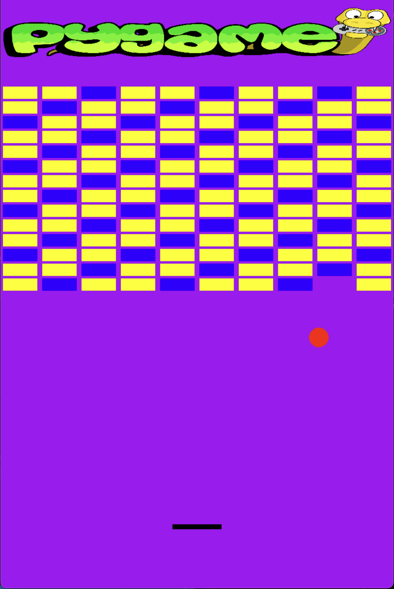
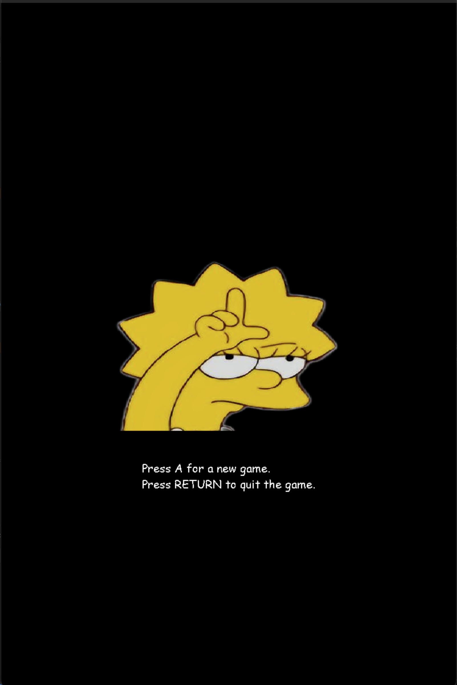

# Breakout Pygame

A simple Breakout game built with Python and Pygame.

## How to play

- **Left / Right arrow**: move the paddle
- **A**: start a new game after game over
- **ENTER**: quit the game

 
 
